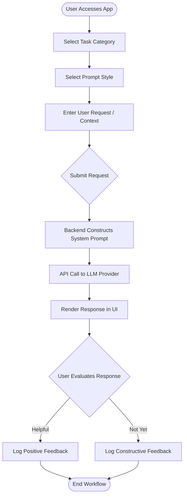
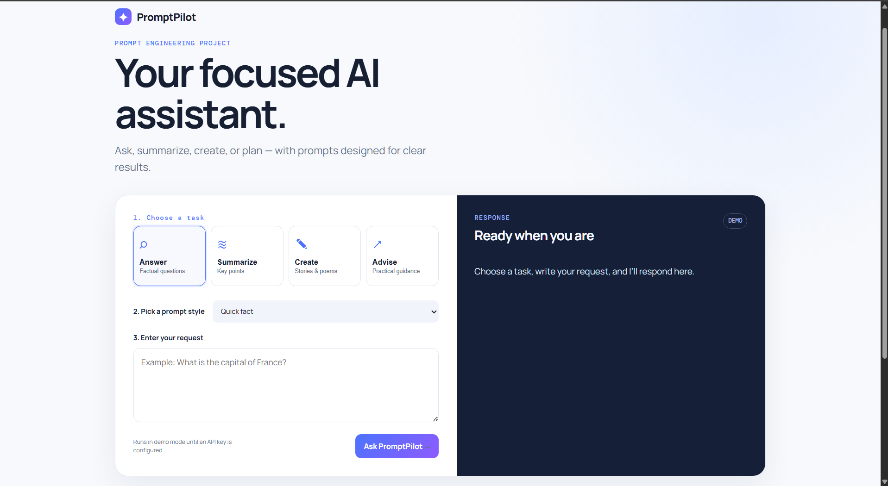
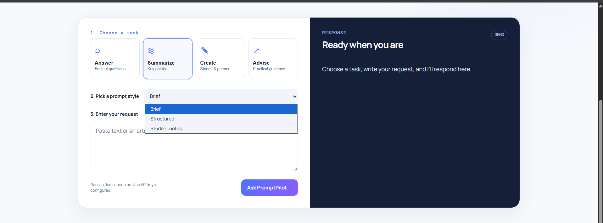
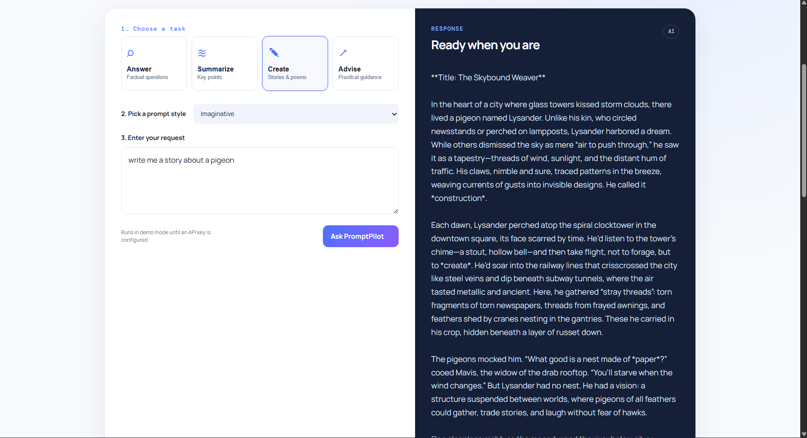
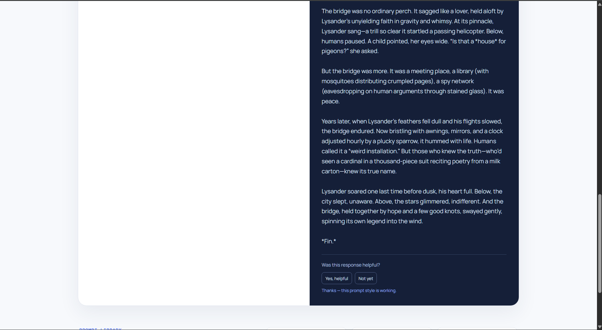

# Project Title: PromptPilot – An AI Assistant for Prompt Engineering and Task Automation

**Student Name:** Mohamed Shakeel  

---

## Executive Summary
PromptPilot is a responsive, web-based artificial intelligence assistant designed to streamline user interactions with large language models through structured prompt engineering. By abstracting the complexity of prompt creation into intuitive task categories and prompt styles, the application ensures high-quality, consistent outputs. The system features four primary assistant modes, customizable output styles, and a local feedback collection loop to continuously refine prompt effectiveness. PromptPilot is deployed live on Vercel utilizing a serverless Node.js backend.

---

## Project Overview

**What is PromptPilot?**  
PromptPilot is a specialized web interface that acts as an intermediary between users and AI models. It provides pre-engineered prompt templates for common tasks to guarantee optimal AI responses.

**Why it was developed & Problem it solves:**  
Users frequently struggle to extract accurate, well-formatted, or correctly toned responses from AI due to a lack of prompt engineering experience (often referred to as the "blank canvas problem"). PromptPilot solves this by constraining the inputs and dynamically injecting system instructions that guide the AI to produce specific, reliable results without requiring the user to master prompt design.

**Target Users:**  
- **Students:** For studying, summarizing notes, and generating revision material.
- **Professionals & Writers:** For brainstorming, drafting creative content, and synthesizing information.
- **General Users:** Seeking actionable advice and quick factual answers.

---

## Objectives
1. **Simplify AI Interaction:** Lower the barrier to entry for effective AI utilization through an intuitive graphical interface.
2. **Implement Structured Prompting:** Utilize system-level prompt engineering to maintain consistent tone, length, and format across responses.
3. **Establish a Feedback Loop:** Collect user feedback to evaluate and iteratively improve the underlying prompt logic.
4. **Deploy a Scalable Architecture:** Create a lightweight, serverless application capable of secure API communication.

---

## Features

- **Four Assistant Modes:** Categorized task selections to fit user needs (Answer, Summarize, Create, Advise).
- **Three Prompt Styles per Mode:** Each mode includes three unique sub-styles that adjust the AI's persona, output length, and formatting constraint (e.g., "Quick fact" vs "Study answer").
- **Local Feedback Collection:** A built-in rating system ("Yes, helpful" / "Not yet") that records user satisfaction data asynchronously to evaluate prompt effectiveness.
- **Responsive Web Interface:** A modern, accessible frontend design that adapts to desktop and mobile environments.
- **Live Deployment:** Hosted reliably on Vercel using serverless functions.
- **Version Control:** Fully tracked and maintained via a GitHub repository.

---

## System Workflow

The user journey follows a strict, sequential pipeline ensuring the generated prompt is highly contextualized before it reaches the AI provider.

---

## Prompt Engineering Methodology

Prompt engineering is the core driver of PromptPilot's accuracy and utility. Instead of passing raw user input directly to the model, the backend wraps the input in rigorously tested system instructions.

- **Prompt Categories:** Tasks are divided by fundamental cognitive intent (Factual Recall, Synthesis, Generation, and Coaching).
- **Prompt Variations:** Within each category, variables like *Role*, *Audience*, and *Format* are adjusted. For example, a "Student notes" summary prompt explicitly instructs the AI to use bullet points and highlight key terminology, whereas a "Brief" prompt enforces strict word limits.
- **Response Consistency:** By anchoring the AI with a strong system persona (e.g., "You are a precise summarizer"), the application drastically reduces hallucinations and off-topic dialogue.
- **User-Controlled Selection:** Users remain in control of the output format without needing to know the technical verbiage required to achieve it.
- **Why it improves results:** LLMs operate on probability. Narrowing the context window through highly specific instructions limits the probability of the model generating irrelevant data.

---

## Technologies Used

| Technology | Purpose |
| :--- | :--- |
| **Node.js** | Backend runtime environment handling API requests and file system operations. |
| **Vanilla JavaScript (ES6)** | Frontend DOM manipulation and asynchronous fetching without heavy frameworks. |
| **HTML5 & CSS3** | Semantic structure and responsive styling of the user interface. |
| **OpenRouter / OpenAI APIs** | Large Language Model providers utilized for natural language processing and generation. |
| **Vercel / @vercel/node** | Cloud platform for continuous deployment and serverless backend execution. |
| **Git & GitHub** | Source code version control and remote repository hosting. |

---

## Project Architecture

PromptPilot employs a lightweight client-server architecture. The frontend communicates with a serverless Node.js backend to prevent exposing secure API keys to the client. The backend routes the request to the designated AI provider, retrieves the response, and serves it back to the client.

---

## User Guide

### 1. Accessing the Application
Navigate to the live deployment link using any modern web browser:  
[https://promptpilot-six.vercel.app](https://promptpilot-six.vercel.app)

### 2. Core Navigation
1. **Choose a Task:** On the left panel, select your overarching goal (Answer, Summarize, Create, or Advise).
2. **Choose a Prompt Style:** Under the task description, select the specific format you require. 
3. **Enter Request:** Type or paste your context into the text area.
4. **Generate:** Click **Ask PromptPilot** to initiate the AI request.

### 3. Prompt Styles Overview
- **Answer:** *Quick fact* (direct), *Explain simply* (beginner-friendly), *Study answer* (detailed with key terms).
- **Summarize:** *Brief* (3 bullets), *Structured* (main idea + conclusion), *Student notes* (revision-focused).
- **Create:** *Imaginative* (vivid), *Constrained* (strict format), *Polished* (refined ending).
- **Advise:** *Action plan* (5 steps), *Supportive* (encouraging), *Compare options* (trade-off analysis).

### 4. Providing Feedback
Beneath the AI's response, you will be prompted to evaluate the output. Clicking **Yes, helpful** or **Not yet** sends asynchronous data to the backend to help developers refine the internal prompt structures.

### 5. Troubleshooting
- **Website does not load:** Verify your internet connection.
- **App displays "DEMO" mode:** This indicates the live serverless environment does not have active API keys configured in its environment variables, falling back to pre-programmed offline responses.

---

## Testing

The application was validated through manual functional testing to ensure the prompt routing, API integration, and UI state management operate as intended.

| Test Case | Input | Expected Result | Actual Result | Status |
| :--- | :--- | :--- | :--- | :--- |
| **UI Rendering** | Navigate to URL | Page loads with CSS styling and all 4 task buttons visible | As expected | Pass |
| **Prompt Selection** | Click "Summarize" -> "Brief" | UI updates to highlight selection; state holds "Brief" | As expected | Pass |
| **Empty Submission** | Click "Ask" with empty input | Warning/Error shown preventing API call | Error caught | Pass |
| **API Request (Demo)**| "capital of france" (Answer) | Server returns fallback demo string "Paris" | Demo string returned | Pass |
| **Feedback Logging** | Click "Yes, helpful" | Success message displayed; JSON payload sent | Status 200 OK | Pass |

---

## Screenshots

*Home Page showcasing the clean UI*

*Task and Prompt Style Selection*

*Generated Response Output in the dark panel*

*Feedback Evaluation Dialog*

---

## Deployment

The application is fully containerized for serverless execution and continuously deployed.

- **Deployment Platform:** Vercel
- **Live URL:** [https://promptpilot-six.vercel.app](https://promptpilot-six.vercel.app)
- **Source Code:** [https://github.com/Shak33LX/promptpilot-ai-assistant](https://github.com/Shak33LX/promptpilot-ai-assistant)

**Note on Demo Mode:** To protect billing quotas, the live deployment environment variables for the LLM provider are intentionally omitted. The application gracefully degrades into a "Demo Mode" utilizing hardcoded fallback responses for evaluation purposes.

---

## Future Improvements

Based on the current architecture, logical future enhancements include:
- **Conversation History:** Implementing local storage or a database to retain previous prompts and responses across sessions.
- **Export Functionality:** Allowing users to download responses as `.txt` or `.pdf` files.
- **Analytics Dashboard:** Creating an admin view to visualize the data collected in the `feedback.json` file.
- **Authentication:** Adding user accounts to personalize prompt preferences.
- **Provider Toggles:** Allowing users to switch between models (e.g., Claude 3 vs GPT-4) directly from the UI.

---

## Limitations

- **Stateless Architecture:** The application currently treats every request as an isolated event; it does not retain context or memory of previous turns in the conversation.
- **Feedback Storage:** The current `feedback.json` approach is suitable for prototyping but is not scalable or persistent across serverless function restarts in a production environment.
- **API Dependency:** The application relies entirely on the uptime and latency of third-party LLM providers.

---

## Conclusion

PromptPilot successfully demonstrates the practical application of prompt engineering within a user-friendly software environment. By removing the friction of manual prompt construction, the project achieves its goal of making AI interactions more predictable, structured, and useful. The implementation of a lightweight Node.js backend deployed on Vercel proves the viability of serverless architectures for AI wrappers, resulting in a responsive, scalable, and highly functional prototype.

---

## References

1. **PromptPilot Live Deployment:** [https://promptpilot-six.vercel.app](https://promptpilot-six.vercel.app)
2. **Source Code Repository:** [https://github.com/Shak33LX/promptpilot-ai-assistant](https://github.com/Shak33LX/promptpilot-ai-assistant)
3. **OpenRouter API Documentation:** https://openrouter.ai/docs
